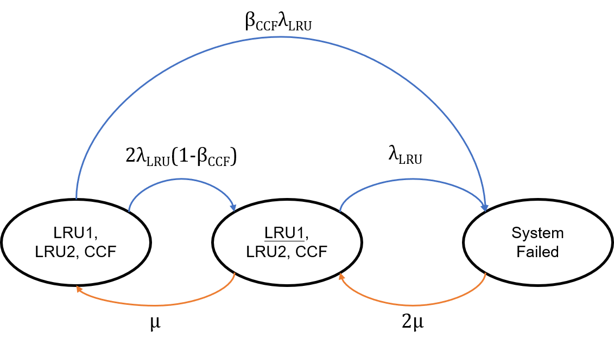
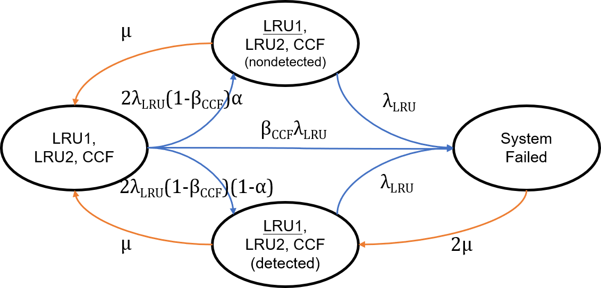

# Final Report of ST4 Industrial Challenge

_**A4 Group: Haoyi HAN, Ting GAO, Songliang HAN, Jiale ZHANG**_

## Contents

- [RAM Characteristics](#RAM Characteristics)
- [Reliability & Availability Analysis](#Reliability & Availability Analysis)
    - [Carborne Controller](#Carborne Controller)
    - [Central Interlocking](#Central Interlocking)
    - [Object Controller](#Object Controller)
    - [Fleet](#Fleet)
    - [Trackside](#Trackside)
    - [System](#System)
    - [Numerical Application & Results](#Numerical Application & Results)

- [Delay Analysis](#Delay Analysis)
- [Conclusion](#Conclusion)
- [Acknowledgment](#Acknowledgment)
- [Annexes](#Annexes)
    - [Construction of redundant system class](#Construction of redundant system class)
    - [Calculation of MTTF, AS, MTTR](#Calculation of MTTF, AS, MTTR)

- [References](#References)

## RAM Characteristics


## Reliability & Availability Analysis

​    Before our study on the analysis of reliability and availability of system components and the whole system, we are willing to propose firstly the methodology we are following because the calculation is very similar among the three components CC, CIXL and OC. We will use a state-transition diagram to represent the different states (up, half-down or down) when a component works, from which we could write a transition matrix. Suppose that the transition matrix is 4×4, then we can write it as:
$$
{
\mathbb{A} = \left[\matrix{
a_{11} & a_{12} & a_{13} & a_{14}\\
a_{21} & a_{22} & a_{23} & a_{24}\\
a_{31} & a_{32} & a_{33} & a_{34}\\
a_{41} & a_{42} & a_{43} & a_{44}
}\right]
}
$$
​    To calculate AS (service availability), we try to solve a linear matrix equation $\mathbb{PA} = \mathbb{O}$ where $\mathbb{O} = \left[\matrix{0 & 0 & 0 & 0}\right]$ a zero row vector and  $\mathbb{P} = \left[\matrix{p_1 & p_2 & p_3 & p_4}\right]$ with $p_1+p_2+p_3+p_4=1$.  (In fact, we take $\frac{d\mathbb{P}(t)}{dt} = \mathbb{P}(t)\mathbb{A}$, and the zero derivative leads a steady state probability vector $\mathbb{P}$. Given that the matrix is not full rank, we add the condition $p_1+p_2+p_3+p_4=1$ to make this equation solvable.) Then we have $AS = p_1+p_2+p_3$, which means AS is the sum of probabilities of non-absorbing state in the steady state probability vector.

​    To calculate MTTF (Mean Time to Fail), we try to solve another linear matrix equation using Laplace transform of Kolmogorov differential equation $\mathbb{P}_R^*(s)\mathbb{A}_R = [s\mathbb{P}^*(s)-\mathbb{P}(0)]_R$ where $\mathbb{A}_R$ denotes a reduced transition matrix (without any absorbing states), $\mathbb{P}^*(s)$ the Laplace transform of $\mathbb{P}(t)$ and $\mathbb{P}_R^*(s)$ its reduced form. Then $MTTF = \sum{P_j^*(0)}$ with j representing all the non-absorbing states. In our case, we establish (assuming that only state 4 is absorbing) the equation and we get:
$$
{
\mathbb{A}_R = \left[\matrix{
a_{11} & a_{12} & a_{13}\\
a_{21} & a_{22} & a_{23}\\
a_{31} & a_{32} & a_{33}
}\right]\\
\left[\matrix{p_1 & p_2 & p_3}\right]\mathbb{A}_R = \left[\matrix{-1 & 0 & 0}\right]\\
MTTF = p_1 + p_2 + p_3
}
$$
​    To calculate MTTR (Mean Time to Restoration), knowing that AS can also be calculated by $AS = \frac{MTTF}{MTTF + MTTR}$, then we have:
$$
{
MTTR = MTTF(\frac{1}{AS}-1)
}
$$
​    From now on, we are able to analyze the three components using our tools aforementioned. We will pose respectively for each component their diagram, matrix and other intermediary results, then we take a numerical application for all components and the system. We will show the calculation results at the end of this part. 

### Carborne Controller

​    The state-transition diagram of a carborne controller is below:


​    From this diagram we can write the associated transition matrix:
$$
{
\mathbb{A} = \left[\matrix{
-(2-\beta_{CCF})\lambda_{LRU}-\lambda_{SPF} & 2\lambda_{LRU}(1-\beta_{CCF})\alpha & 2\lambda_{LRU}(1-\beta_{CCF})(1-\alpha) & \beta_{CCF}\lambda_{LRU}+\lambda_{SPF}\\
\mu_0 & -\mu_0-\lambda_{LRU}-\lambda_{SPF} & 0 & \lambda_{LRU}+\lambda_{SPF}\\
\mu_1 & 0 & -\mu_1-\lambda_{LRU}-\lambda_{SPF} & \lambda_{LRU}+\lambda_{SPF}\\
0 & 0 & 2\mu_1 & -2\mu_1
}\right]
}
$$
​    The reduced transition matrix we will use in the calculation of MTTF:
$$
{
\mathbb{A}_R = \left[\matrix{
-(2-\beta_{CCF})\lambda_{LRU}-\lambda_{SPF} & 2\lambda_{LRU}(1-\beta_{CCF})\alpha & 2\lambda_{LRU}(1-\beta_{CCF})(1-\alpha)\\
\mu_0 & -\mu_0-\lambda_{LRU}-\lambda_{SPF} & 0\\
\mu_1 & 0 & -\mu_1-\lambda_{LRU}-\lambda_{SPF}
}\right]
}
$$

### Central Interlocking

​    The state-transition diagram of a central interlocking is below:



​    From this diagram we can write the associated transition matrix:
$$
{
\mathbb{A} = \left[\matrix{
-(2-\beta_{CCF})\lambda_{LRU} & 2\lambda_{LRU}(1-\beta_{CCF}) & \beta_{CCF}\lambda_{LRU}\\
\mu & -\mu-\lambda_{LRU} & \lambda_{LRU}\\
0 & 2\mu & -2\mu
}\right]
}
$$
​    The reduced transition matrix we will use in the calculation of MTTF:
$$
{
\mathbb{A}_R = \left[\matrix{
-(2-\beta_{CCF})\lambda_{LRU} & 2\lambda_{LRU}(1-\beta_{CCF})\\
\mu & -\mu-\lambda_{LRU}
}\right]
}
$$

### Object Controller

​    The state-transition diagram of a central interlocking is below:



​    From this diagram we can write the associated transition matrix:
$$
{
\mathbb{A} = \left[\matrix{
-(2-\beta_{CCF})\lambda_{LRU} & 2\lambda_{LRU}(1-\beta_{CCF})\alpha & 2\lambda_{LRU}(1-\beta_{CCF})(1-\alpha) & \beta_{CCF}\lambda_{LRU}\\
\mu & -\mu-\lambda_{LRU} & 0 & \lambda_{LRU}\\
\mu & 0 & -\mu-\lambda_{LRU} & \lambda_{LRU}\\
0 & 0 & 2\mu & -2\mu
}\right]
}
$$
​    The reduced transition matrix we will use in the calculation of MTTF:
$$
{
\mathbb{A}_R = \left[\matrix{
-(2-\beta_{CCF})\lambda_{LRU} & 2\lambda_{LRU}(1-\beta_{CCF})\alpha & 2\lambda_{LRU}(1-\beta_{CCF})(1-\alpha)\\
\mu & -\mu-\lambda_{LRU} & 0\\
\mu & 0 & -\mu-\lambda_{LRU}
}\right]
}
$$

### Fleet

​    We assume that a fleet could be seen as a series of trains (i.e. CC). Under this assumption, we have (N is the number of CCs in a fleet):

$$
{
MTTF_{Fleet} = \frac{1}{N\times\frac{1}{MTTF_{CC}}}\\
AS_{Fleet} = AS_{CC}^N\\
MTTR_{Fleet} = MTTF_{Fleet}(\frac{1}{AS_{Fleet}}-1)
}
$$

### Trackside

​    Similarly, we assume that a trackside could be seen as a series of a central interlocking and some object controllers. Under this assumption, we have (N' is the number of OCs in trackside):
$$
{
MTTF_{Trackside} = \frac{1}{\frac{1}{MTTF_{CIXL}}+N'\times\frac{1}{MTTF_{OC}}}\\
AS_{Trackside} = AS_{CIXL}AS_{OC}^{N'}\\
MTTR_{Trackside} = MTTF_{Trackside}(\frac{1}{AS_{Trackside}}-1)
}
$$

### System

​    Still, we assume that a system could be seen as a series of a fleet and trackside. Under this assumption, we have:
$$
{
MTTF_{System} = \frac{1}{\frac{1}{MTTF_{Fleet}}+\frac{1}{MTTF_{Trackside}}}\\
AS_{System} = AS_{Fleet}AS_{Trackside}\\
MTTR_{System} = MTTF_{System}(\frac{1}{AS_{System}}-1)
}
$$

### Numerical Application & Results

​    We have found useful data from the given document to calculate:

|      | $\lambda_{LRU}$ (h^-1^) | $\alpha$^*^ | $\beta_{CCF}$ | $\lambda_{SPF}$ (h^-1^) | $\mu_0$ (h^-1^) | $\mu_1$ (h^-1^)^**^ |
| ---- | ----------------------- | ----------- | ------------- | ----------------------- | --------------- | ------------------- |
| CC   | 1/20000                 | 5%          | 1%            | 2.00e-07                | 1/0.5           | 1/0.935             |
| CIXL | 1/170000                | 0           | 1%            | 0                       | 1/0.25          | 1/0.25              |
| OC   | 1/220000                | 2%          | 1%            | 0                       | 1/0.75          | 1/0.75              |

​    (\*): $\alpha$ is the difference between 1 and fault detection.

​    (\*\*): $\mu$ is calculated from MLD in the given document. For CC, $\mu_0$ is from Degraded MLD (Nominal) and $\mu_1$ is from the mean value of two Degraded MLD (Emergency). For CIXL and OC, $\mu_0=\mu_1=\mu$, which is from MLD.     

​    Finally, we get all the results below:

|           | MTTF (year) | MTTR (min) | AS            | 1 - AS   |
| --------- | ----------- | ---------- | ------------- | -------- |
| CC        | 394         | 28.1       | 0.999999671   | 3.29e-07 |
| CIXL      | 4721        | 7.5        | 0.99999999264 | 7.36e-09 |
| OC        | 6107        | 22.5       | 0.9999999829  | 1.71e-08 |
| Fleet     | 22          | 28.0       | 0.99999407    | 5.93e-06 |
| Trackside | 837         | 19.8       | 0.999999890   | 1.10e-07 |
| System    | 21          | 27.8       | 0.99999396    | 6.04e-06 |

## Delay Analysis


## Conclusion


## Acknowledgment


## Annexes

### Construction of redundant system class

```python
import math
import numpy as np

class RedundantSystem:
    def __init__(self, name, MTTF, MTTSF, alpha, beta_CCF, lambda_SPF, MRT, MAD, MLD, MTD, dMLDn, dMLDe, MTBPM):
        self.name = name
        # self.MTTF is intrinsic MTTF, not the final MTTF we calculated
        self.MTTF = MTTF
        # self.MTTSF is component service MTTF, not the final MTTF we calculated
        self.MTTSF = MTTSF
        self.MRT = MRT
        self.MAD = MAD
        self.MLD = MLD
        self.MTD = MTD
        self.dMLDn = dMLDn
        self.dMLDe = dMLDe
        self.MTBPM = MTBPM
        self.MACMT = self.MRT + self.MTD
        self.MCMT = self.MLD + self.MACMT
        self.lambda_LRU = 1 / self.MTTSF
        self.alpha = alpha
        self.beta_CCF = beta_CCF
        self.lambda_SPF = lambda_SPF
        # Set MFDT to 0 when MTBPM isn't given
        self.MFDT = 0 if self.MTBPM == 0 else self.MTBPM / (1-np.exp(-self.lambda_LRU*self.MTBPM)) - 1 / self.lambda_LRU
        # self.MTTSF_final is a MTTSF we calculated from given formulas
        self.MTTSF_final = 2/(self.lambda_LRU + self.lambda_SPF) - 1/((2-self.beta_CCF)*self.lambda_LRU + self.lambda_SPF)
        # self.MTTR is a MTTR we calculated from given formulas
        self.MTTR = self.MAD + self.MFDT + self.MCMT
    def summary(self):
        name_dir = ['MTTF', 'MTTSF', 'lambda_LRU', 'alpha', 'beta_CCF', 'lambda_SPF', 'MRT', 'MAD', 'MLD', 'MTD', 'dMLDn', 'dMLDe', 'MTBPM', 'MFDT', 'MACMT', 'MCMT', 'MTTSF_final', 'MTTR']
        tlpt = '{0:10}\t{1:10}'
        print('============')
        print('SUMMARY of SYSTEM %s'%self.name)
        for name in name_dir:
            if name == 'dMLDe':
                print('{0:10}\t{1:10}\t{2:10}'.format(name, self.dMLDe[0], self.dMLDe[1]))
            else:
                print(tlpt.format(name, getattr(self, name)))
        print('============')
        
CC = RedundantSystem(name='CC', MTTF=10000, MTTSF=20000, alpha=0.05, beta_CCF=0.01, lambda_SPF=2e-7, MRT=0.25, MAD=0, MLD=0.935, MTD=0, dMLDn=0.5, dMLDe=(0.25+0.6, 0.42+0.6), MTBPM=3600)
CIXL = RedundantSystem(name='CIXL', MTTF=100000, MTTSF=170000, alpha=0, beta_CCF=0.01, lambda_SPF=0, MRT=0.25, MAD=0, MLD=0.25, MTD=0, dMLDn=0, dMLDe=(0, 0), MTBPM=0)
OC = RedundantSystem(name='OC', MTTF=200000, MTTSF=220000, alpha=0.02, beta_CCF=0.01, lambda_SPF=0, MRT=0.75, MAD=0, MLD=0.75, MTD=0, dMLDn=0, dMLDe=(0, 0), MTBPM=18000)

CC.summary()
CIXL.summary()
OC.summary()
```

​    The code above shows a result below:

```python
============
SUMMARY of SYSTEM CC
MTTF                 10000
MTTSF                20000
lambda_LRU           5e-05
alpha                 0.05
beta_CCF              0.01
lambda_SPF           2e-07
MRT                   0.25
MAD                      0
MLD                  0.935
MTD                      0
dMLDn                  0.5
dMLDe                 0.85            1.02
MTBPM                 3600
MFDT            1853.97086247665
MACMT                 0.25
MCMT                 1.185
MTTSF_final     29810.54717938677
MTTR            1855.1558624766499
============
============
SUMMARY of SYSTEM CIXL
MTTF                100000
MTTSF               170000
lambda_LRU      5.882352941176471e-06
alpha                    0
beta_CCF              0.01
lambda_SPF               0
MRT                   0.25
MAD                      0
MLD                   0.25
MTD                      0
dMLDn                    0
dMLDe                    0               0
MTBPM                    0
MFDT                     0
MACMT                 0.25
MCMT                   0.5
MTTSF_final     254572.86432160804
MTTR                   0.5
============
============
SUMMARY of SYSTEM OC
MTTF                200000
MTTSF               220000
lambda_LRU      4.5454545454545455e-06
alpha                 0.02
beta_CCF              0.01
lambda_SPF               0
MRT                   0.75
MAD                      0
MLD                   0.75
MTD                      0
dMLDn                    0
dMLDe                    0               0
MTBPM                18000
MFDT            9122.713582197204
MACMT                 0.75
MCMT                   1.5
MTTSF_final     329447.2361809045
MTTR            9124.213582197204
============
```

### Calculation of MTTF, AS, MTTR

```python
import math
import numpy as np 
import scipy
from scipy.special import comb

def calc_CC(lambda_LRU, alpha, beta_CCF, lambda_SPF, mu_0, mu_1):
    # A is original transition matrix of diagram
    A = np.matrix([
        [-(2-beta_CCF)*lambda_LRU-lambda_SPF, 2*lambda_LRU*(1-beta_CCF)*alpha, 2*lambda_LRU*(1-beta_CCF)*(1-alpha), beta_CCF*lambda_LRU+lambda_SPF],
        [mu_0, -mu_0-lambda_LRU-lambda_SPF, 0, lambda_LRU+lambda_SPF],
        [mu_1, 0, -mu_1-lambda_LRU-lambda_SPF, lambda_LRU+lambda_SPF],
        [0, 0, 2*mu_1, -2*mu_1]
    ])
    # A_calc is transition matrix with condition sum(p_i)=1 to calculate AS
    A_calc = np.matrix([
        [-(2-beta_CCF)*lambda_LRU-lambda_SPF, 2*lambda_LRU*(1-beta_CCF)*alpha, 2*lambda_LRU*(1-beta_CCF)*(1-alpha), 1],
        [mu_0, -mu_0-lambda_LRU-lambda_SPF, 0, 1],
        [mu_1, 0, -mu_1-lambda_LRU-lambda_SPF, 1],
        [0, 0, 2*mu_1, 1]
    ])
    O = np.matrix([0, 0, 0, 1])
    P = np.asarray(np.linalg.solve(A_calc.T, O.T).T).flatten()
    AS = P[0] + P[1] + P[2]
    # A_calc1 is transition matrix without down state to calculate MTTF
    A_calc1 = np.matrix([
        [-(2-beta_CCF)*lambda_LRU-lambda_SPF, 2*lambda_LRU*(1-beta_CCF)*alpha, 2*lambda_LRU*(1-beta_CCF)*(1-alpha)],
        [mu_0, -mu_0-lambda_LRU-lambda_SPF, 0],
        [mu_1, 0, -mu_1-lambda_LRU-lambda_SPF]
    ])
    O = np.matrix([-1, 0, 0])
    P = np.asarray(np.linalg.solve(A_calc1.T, O.T).T).flatten()
    MTTF = P[0] + P[1] + P[2]
    return (MTTF, AS)

def calc_CIXL(lambda_LRU, beta_CCF, mu):
    # A is original transition matrix of diagram
    A = np.matrix([
        [-(2-beta_CCF)*lambda_LRU, 2*lambda_LRU*(1-beta_CCF), beta_CCF*lambda_LRU],
        [mu, -mu-lambda_LRU, lambda_LRU],
        [0, 2*mu, -2*mu]
    ])
    # A_calc is transition matrix with condition sum(p_i)=1 to calculate AS
    A_calc = np.matrix([
        [-(2-beta_CCF)*lambda_LRU, 2*lambda_LRU*(1-beta_CCF), 1],
        [mu, -mu-lambda_LRU, 1],
        [0, 2*mu, 1]
    ])
    O = np.matrix([0, 0, 1])
    P = np.asarray(np.linalg.solve(A_calc.T, O.T).T).flatten()
    AS = P[0] + P[1]
    # A_calc1 is transition matrix without down state to calculate MTTF
    A_calc1 = np.matrix([
        [-(2-beta_CCF)*lambda_LRU, 2*lambda_LRU*(1-beta_CCF)],
        [mu, -mu-lambda_LRU],
    ])
    O = np.matrix([-1, 0])
    P = np.asarray(np.linalg.solve(A_calc1.T, O.T).T).flatten()
    MTTF = P[0] + P[1]
    return (MTTF, AS)

def calc_OC(lambda_LRU, alpha, beta_CCF, mu):
    # A is original transition matrix of diagram
    A = np.matrix([
        [-(2-beta_CCF)*lambda_LRU, 2*lambda_LRU*(1-beta_CCF)*alpha, 2*lambda_LRU*(1-beta_CCF)*(1-alpha), beta_CCF*lambda_LRU],
        [mu, -mu-lambda_LRU, 0, lambda_LRU],
        [mu, 0, -mu-lambda_LRU, lambda_LRU],
        [0, 0, 2*mu, -2*mu]
    ])
    # A_calc is transition matrix with condition sum(p_i)=1 to calculate AS
    A_calc = np.matrix([
        [-(2-beta_CCF)*lambda_LRU, 2*lambda_LRU*(1-beta_CCF)*alpha, 2*lambda_LRU*(1-beta_CCF)*(1-alpha), 1],
        [mu, -mu-lambda_LRU, 0, 1],
        [mu, 0, -mu-lambda_LRU, 1],
        [0, 0, 2*mu, 1]
    ])
    O = np.matrix([0, 0, 0, 1])
    P = np.asarray(np.linalg.solve(A_calc.T, O.T).T).flatten()
    AS = P[0] + P[1] + P[2]
    # A_calc1 is transition matrix without down state to calculate MTTF
    A_calc1 = np.matrix([
        [-(2-beta_CCF)*lambda_LRU, 2*lambda_LRU*(1-beta_CCF)*alpha, 2*lambda_LRU*(1-beta_CCF)*(1-alpha)],
        [mu, -mu-lambda_LRU, 0],
        [mu, 0, -mu-lambda_LRU]
    ])
    O = np.matrix([-1, 0, 0])
    P = np.asarray(np.linalg.solve(A_calc1.T, O.T).T).flatten()
    MTTF = P[0] + P[1] + P[2]
    return (MTTF, AS)

def calc_Fleet(N, lambda_LRU, alpha, beta_CCF, lambda_SPF, mu_0, mu_1):
    MTTF_CC, AS_CC = calc_CC(lambda_LRU, alpha, beta_CCF, lambda_SPF, mu_0, mu_1)
    MTTF_Fleet = MTTF_CC / N
    AS_Fleet = AS_CC ** N
    return (MTTF_Fleet, AS_Fleet)

def calc_Track(N, lambda_LRU_CIXL, beta_CCF_CIXL, mu_CIXL, lambda_LRU_OC, alpha_OC, beta_CCF_OC, mu_OC):
    MTTF_CIXL, AS_CIXL = calc_CIXL(lambda_LRU_CIXL, beta_CCF_CIXL, mu_CIXL)
    MTTF_OC, AS_OC = calc_OC(lambda_LRU_OC, alpha_OC, beta_CCF_OC, mu_OC)
    MTTF_Track = 1/ (1/MTTF_CIXL + (1/MTTF_OC) * N)
    AS_Track = AS_CIXL * (AS_OC ** N)
    return MTTF_Track, AS_Track

def calc_MTTR(MTTF, AS):
    # return MTTR in minutes
    return MTTF * (1 / AS - 1) * 60

MTTF_CC, AS_CC = calc_CC(1/20000, 0.05, 0.01, 2e-7, 1/0.5, 1/((1.20+0.25+0.42)/2))
MTTF_CIXL, AS_CIXL = calc_CIXL(1/170000, 0.01, 1/0.25)
MTTF_OC, AS_OC = calc_OC(1/220000, 0.02, 0.01, 1/0.75)
MTTF_Fleet, AS_Fleet = calc_Fleet(18, 1/20000, 0.05, 0.01, 2e-7, 1/0.5, 1/((1.20+0.25+0.42)/2))
MTTF_Track, AS_Track = calc_Track(6, 1/170000, 0.01, 1/0.25, 1/220000, 0.02, 0.01, 1/0.75)
MTTF_Sys = 1 / (1/MTTF_Fleet + 1/MTTF_Track)
AS_Sys = AS_Fleet * AS_Track

tq = '{0:20}\t{1:20}\t{2:20}\t{3:20}\t{4:20}'
print(tq.format(' ', 'MTTF (year)', 'AS', '1-AS', 'MTTR (min)'))
print(tq.format('CC', MTTF_CC/3600, AS_CC, 1-AS_CC, calc_MTTR(MTTF_CC, AS_CC)))
print(tq.format('CIXL', MTTF_CIXL/3600, AS_CIXL, 1-AS_CIXL, calc_MTTR(MTTF_CIXL, AS_CIXL)))
print(tq.format('OC', MTTF_OC/3600, AS_OC, 1-AS_OC, calc_MTTR(MTTF_OC, AS_OC)))
print(tq.format('Fleet', MTTF_Fleet/3600, AS_Fleet, 1-AS_Fleet, calc_MTTR(MTTF_Fleet, AS_Fleet)))
print(tq.format('Track', MTTF_Track/3600, AS_Track, 1-AS_Track, calc_MTTR(MTTF_Track, AS_Track)))
print(tq.format('System', MTTF_Sys/3600, AS_Sys, 1-AS_Sys, calc_MTTR(MTTF_Sys, AS_Sys)))
```

​    The code above shows a result below:

```python
                        MTTF (year)             AS                      1-AS                    MTTR (min)
CC                        394.30479234572823      0.9999996706429123    3.293570877138663e-07     28.051298103248648
CIXL                       4720.861370471564      0.9999999926449286     7.3550714407844e-09       7.500010890641265
OC                          6107.03012968612      0.9999999829430977    1.705690233499979e-08     22.500075852357917
Fleet                       21.9058217969849       0.999994071589018    5.928410982014576e-06     28.051376634312987
Track                      837.3105409180151      0.9999998903035197    1.0969648034375723e-07    19.839606335955942
System                      21.3473303047082       0.999993961893188    6.038106811989685e-06      27.84201958767658
```


## References


